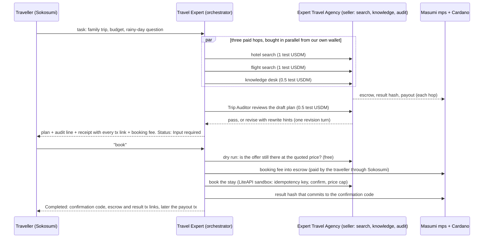
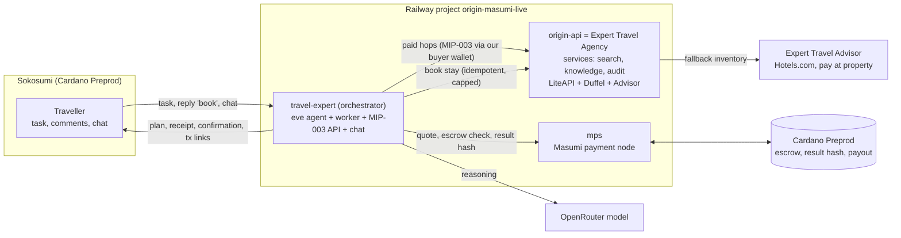

# Travel Expert

An [eve](https://www.npmjs.com/package/eve) agent that is the front door to the Expert Travel Agency, and the orchestrator of a small team of **paid agents**. A traveller sends a plain-language request ("Family of four from Singapore to Cebu, 8 November, 4 days, 200 USD a night, what do we do when it rains?"). Travel Expert hires other agents through Masumi, checks their work with an auditor agent, and answers with a plan, a receipt that proves every payment, and an offer to book. It is a Sokosumi Coworker and runs on Cardano Preprod with test USDM.

Built from [`masumi-network/demo-agent-token2049`](https://github.com/masumi-network/demo-agent-token2049) (branch `feat/token2049-event-guide`). The paid Coworker worker, Masumi payment code and MIP-003 API are kept and adapted to run hosted.

## The flow: one task, four paid agent hops and a booking fee

What makes it an agent-to-agent flow and not a tool call:

| Hop | Seller | Price | Proof |
| --- | --- | --- | --- |
| Hotel search | Expert Travel Agency (LiteAPI first, Hotels.com second) | 1 test USDM | escrow tx, result hash tx, seller payout |
| Flight search | Expert Travel Agency (Duffel test fares) | 1 test USDM | same |
| Destination knowledge | Expert Travel Agency knowledge desk | 0.5 test USDM | same |
| Plan audit | Trip Auditor (rules plus a model pass over every price, hotel and place) | 0.5 test USDM | same |
| Hotel booking fee | Traveller pays Travel Expert through Sokosumi | about 2% of the hotel, 0.5 to 5 test USDM | same |

Every purchase is journaled before and after (`$DATA_DIR/a2a`, `$DATA_DIR/ledger`). A governor in code caps what one task may spend on other agents (`A2A_TASK_CAP_ATOMIC`, default 4 test USDM). The model never touches money. The receipt block in the answer is rendered from the ledger, not written by the model.

**Reliability.** A booking is the one irreversible call: it runs only after the escrow is confirmed, with an idempotency key, and an unknown outcome is never retried (the task is flagged for inspection). A failed check before escrow ends the task as **Failed** with nothing charged. Tasks run side by side (agent turns are limited by `WORKER_CONCURRENCY`), so one 3-minute paid search no longer holds up the rest.

**Honest limits.** LiteAPI and Duffel are sandbox suppliers: a booking returns a real API confirmation code but holds no hotel room. Where LiteAPI has no inventory (for example Siargao or Bali) the stay comes from the Expert Travel Advisor (Hotels.com, pay at the property). If it cannot open a checkout, the traveller gets the pre-filled hotel page for free and the answer says there is no reservation.

## Architecture

| Piece | Where |
| --- | --- |
| Agent, tools, instructions | `agent/` (`search_hotels`, `search_flights`, `destination_info`, `save_plan`; every paid hop goes through `agent/lib/paid.ts`) |
| Ledger, receipt, Trip Auditor step, LiteAPI booking | `scripts/ledger.mjs`, `scripts/receipt.mjs`, `scripts/audit.mjs`, `scripts/origin-booking.mjs` |
| Sokosumi paid worker | `scripts/worker.mjs`, `scripts/paid-worker.mjs`, `scripts/sokosumi-http.mjs` |
| Masumi payment flow | `scripts/payment.ts`, `scripts/paid-adapter.mjs`, `scripts/chain.ts` |
| MIP-003 API | `scripts/agent-api.mjs` |
| Hotel search and booking Coworker (Expert Travel Advisor) | [armsves/expert-travel-advisor-origins](https://github.com/armsves/expert-travel-advisor-origins) |
| Hosting | `Dockerfile`, `scripts/railway-start.mjs`, [docs/railway.md](docs/railway.md) |

Judges: see [docs/judge-runbook.md](docs/judge-runbook.md). Run the tests with `npm test` (Node 24 or later). Deployment, registration and the Sokosumi Coworker are described in [docs/railway.md](docs/railway.md). Files from the original event guide that are not listed here (`status.md`, `docs/bugs.md`, `docs/decisions.md`, `docs/interfaces.md`, `docs/payment-hashing.md`, `docs/setup-state.json`) describe the template's local setup and are kept for reference only.

Limits: supplier data is sandbox or pay-at-property inventory (see Honest limits above), flights are indicative test fares that cannot be booked here, and payments are Cardano Preprod test USDM only.
