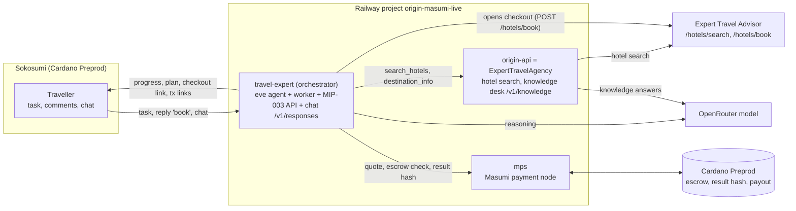
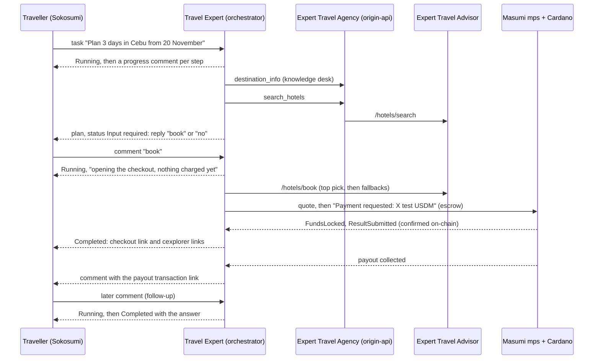

# Travel Expert

An [eve](https://www.npmjs.com/package/eve) agent that is the front door to the Expert Travel Agency. A traveller sends a plain-language request ("Plan 3 days in Cebu from 20 November for 2 people"). The agent searches live hotel rates through the Expert Travel Agency API and answers with a short plan. It is paid per task with test USDM on Cardano Preprod through Masumi, and it is a Sokosumi Coworker.

Built from [`masumi-network/demo-agent-token2049`](https://github.com/masumi-network/demo-agent-token2049) (branch `feat/token2049-event-guide`). The event data and tool were replaced; the paid Coworker worker, Masumi payment code and MIP-003 API are kept and adapted to run hosted.

Request lifecycle of one task:

What is not connected yet: the orchestrator calls the knowledge desk with the internal API key, not with a paid Masumi escrow (that needs a funded purchasing wallet on `mps`), and the advisor at `expert-travel-advisor-eve.vercel.app` (now the worker's default `ADVISOR_URL`) serves MIP-003 routes but completes jobs without payment terms, so it cannot be bought from with Masumi yet.

| Piece | Where |
| --- | --- |
| Agent, tools, instructions | `agent/` (`search_hotels` calls `ORIGIN_API_URL/v1/stays/search`) |
| Sokosumi paid worker | `scripts/worker.mjs`, `scripts/paid-worker.mjs`, `scripts/sokosumi-http.mjs` |
| Masumi payment flow | `scripts/payment.ts`, `scripts/paid-adapter.mjs`, `scripts/chain.ts` |
| MIP-003 API | `scripts/agent-api.mjs` |
| Hotel search and booking Coworker (Expert Travel Advisor) | [armsves/expert-travel-advisor-origins](https://github.com/armsves/expert-travel-advisor-origins) |
| Hosting | `Dockerfile`, `scripts/railway-start.mjs`, [docs/railway.md](docs/railway.md) |

Run the tests with `npm test` (Node 24 or later). Deployment, registration and the Sokosumi Coworker are described in [docs/railway.md](docs/railway.md). Files from the original event guide that are not listed here (`status.md`, `docs/bugs.md`, `docs/decisions.md`, `docs/interfaces.md`, `docs/payment-hashing.md`, `docs/setup-state.json`) describe the template's local setup and are kept for reference only.

Limits: hotel data and checkout links come from the Expert Travel Agency API, which uses sandbox or pay-at-property inventory. The agent cannot book; it hands over the hotel page. Payments are Cardano Preprod test USDM only.
